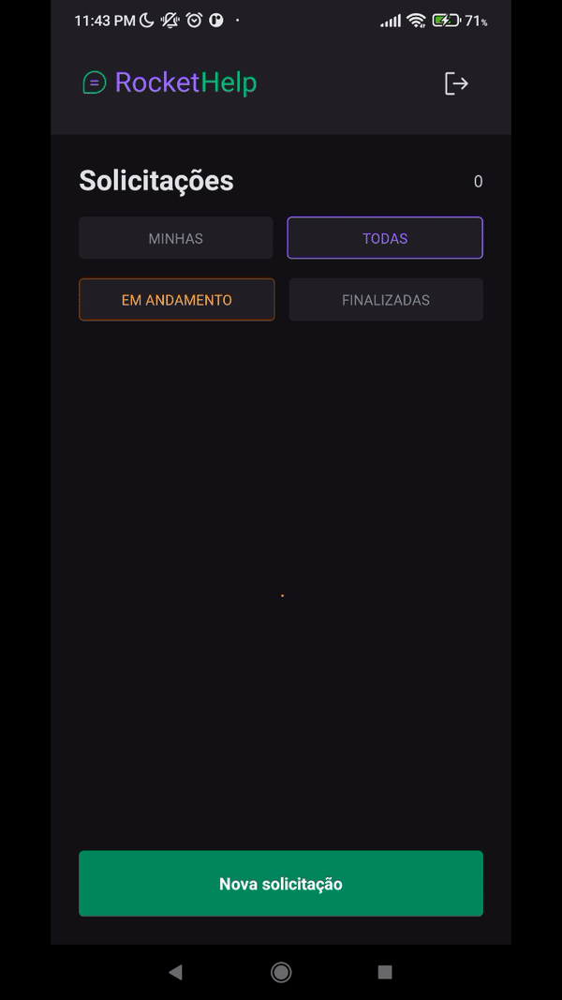

   
   
An help desk mobile application

   

   

      <a href="#about">About</a> •
      <a href="#techs">Techs</a> • 
      <a href="#feats">Features</a> • 
   

   
   

   

<strong>Project layout on</strong> <a target="_blank" href="https://www.figma.com/community/file/1130846653327904117">Figma</a>

<h2 id="about">
   ℹ About
</h2>

    This app was develop during the Ignite Lab 03</a>, a software development bootcamp powered by <a target="_blank" href="https://rocketseat.com.br">@Rocketseat</a>.

   RocketHelp is an help desk application where users can make new help solicitations, especifing his issues while another user can close opened tickets describing the problem solution.

This app uses Firebase services as server. You can check the used techs in the section below.

<h2 id="techs">
   🛠 Tecnologias Utilizadas
</h2>

- [Expo](https://docs.expo.io/)
- [React Native](https://reactnative.dev/)
- [Native Base](https://nativebase.io/)
- [TypeScript](https://www.typescriptlang.org/)
- [Cloud Firestore](https://firebase.google.com/docs/firestore)
- [Firebase Authentication](https://firebase.google.com/docs/auth)

<h2 id="feats">
   🆕 Features
</h2>

- [x] User SignUp with Email And Password
- [x] User SignIn with Email and Password
- [x] User Logout
- [x] Create new solicitation
- [x] List and filter solicitation by status (closed or open)
- [x] List and filter solicitation by user (all users or authenticated user)
- [x] Close open solicitation with solution description
